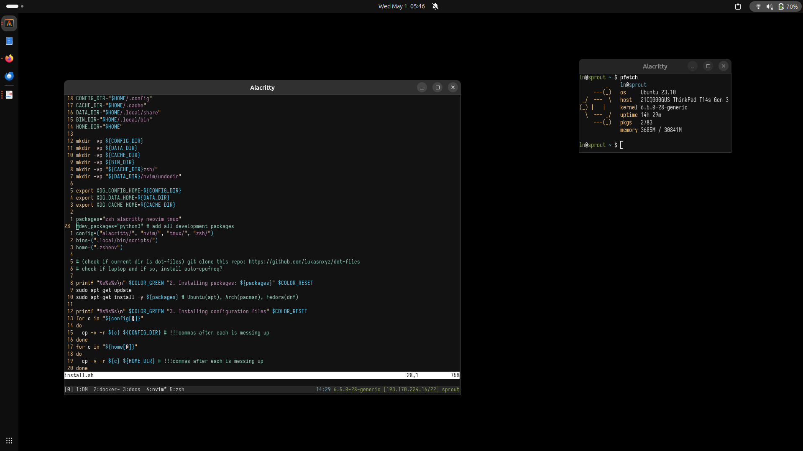

### Personal dot files
I basically just try to have the same development environment on all the systems I use. Alacritty, 
tmux, neovim, and sometimes vscode/jupyter-notebook depending on the work I'm doing.



#### Quick start
Install configs and packages
```shell
chmod +x install.sh
./install.sh
```


#### Things to change/install
vm.swappiness = 1
auto-cpufreq
